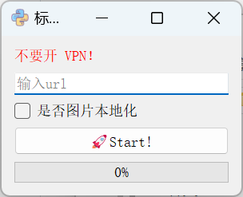
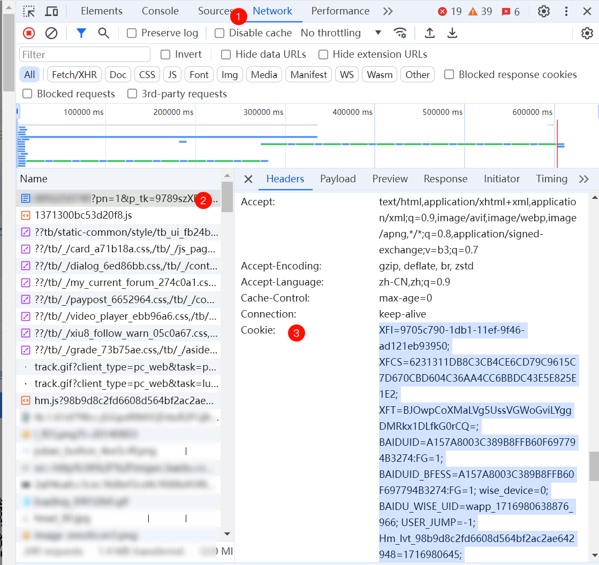

# 贴吧帖子离线保存工具

## 使用说明

**URL**：就是 URL，浏览器地址栏粘过来

**COOKIE**：在浏览器按 `F12` 会出来一个窗口。
1. 选 `Network`/`网络` 
2. 选下面列表第一个，看 `Header` 
3. 找到 `Cookie` 复制它的值

**图片本地化**：会把图片也保存下来（帖子被删掉也能看）。代价是会多花一点点时间

**最大线程数**：不知道是什么的话就别动了

 

> 实测不用登录也可以

## TODO

- [x] 数据爬取
- [x] 多页评论(楼中楼)
- [x] 贴吧样式还原
- [x] 评论头像
- [x] 图片本地化
- [ ] 纯文字版
- [x] 多线程
- [x] GUI
- [x] pyQt 中文路径问题
- [x] GUI 优化
- [ ] 错误提示
- [x] 使用说明
- [ ] 精简 package

## CREDIT

[PyStand](https://github.com/skywind3000/PyStand): 🚀 Python Standalone Deploy Environment !! 